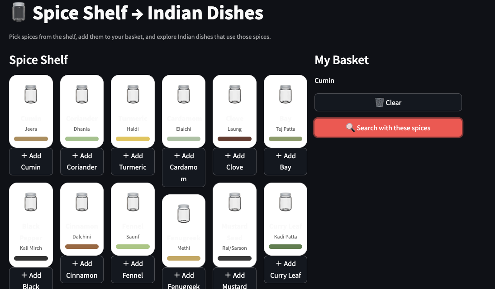

# 🫙 Indian Spice Shelf — Streamlit App

Explore Indian dishes by “picking spices from a shelf.”  
This app lets you select spice jars (like in a real kitchen), then shows matching dishes with photos.  
No heavy recipe text — just **dish name + photo + basic tags** so you can explore fast.

<p align="center">
  
</p>

---

## ✨ What I want to build

- **Spice shelf UI with jars**  
  - Visual jars (photos/illustrations) laid out like a spice rack  
  - Click a jar → it moves to **“My basket”**  
  - Click “Search with these spices” → show dishes that use *all* selected spices (AND filter)

- **Dish result cards with photos**  
  - Show **dish photo, name, region, category, heat**  
  - Click → open Wikipedia (or recipe search) in a new tab  
  - **No local images** if possible — prefer **URLs or API** (Wikimedia / Unsplash)

- **Indian-themed look**  
  - Subtle Indian patterns/colors (saffron, turmeric yellow, deep red)  
  - Clean, modern card layout (no clutter)

- **Data as CSV** (simple, human-editable)  
  - `spices.csv` — list of spices  
  - `recipes.csv` — list of dishes, each with `image_url` and `spices` (JSON array)

---

## 📸 Screenshots (placeholders)

> Replace these files with your real screenshots after you run the app:

- `docs/screenshots/home.png` — shelf + basket  
- `docs/screenshots/select.png` — adding jars to basket  
- `docs/screenshots/results.png` — dish cards with photos

```text
docs/
└─ screenshots/
   ├─ home.png
   ├─ select.png
   └─ results.png
